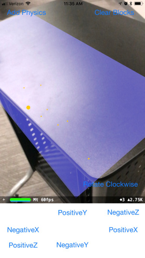
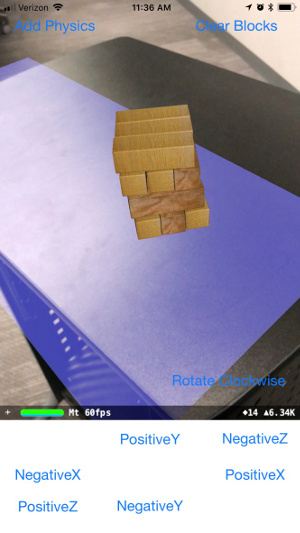
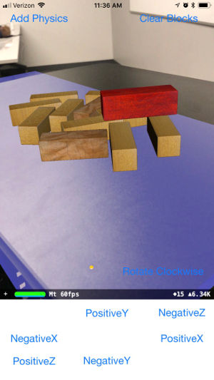

# ARBlocks
ARBlockTower is an iOS game built with Swift and ARKit similar to the classic Jenga tower building game

## Background
This project was 3rd quarter project for the Galvanize Fullstack Web Development Immersive program. For the 3rd quarter, we are encouraged to use a new technology not taught in the program which forces us to research and learn that technology within one week.

We chose to build an AR application in iOS since the program largely focuses on Javascript, and we thought experience with a more standard object-oriented language like Swift would give us a new perspective on architecture and design. In addition to learning Swift, we also were drawn to ARKit based on the potential is has to help developers build an entirely new class of applications focusing on augmented reality as a means of UI.

## How it Works
Blocks are rendered using SceneKit and given physics properties so that they behave like small, wooden blocks. ARKit plane detection is used to identify a playing surface, where the blocks can be rendered in rotating rows to build the tower.

Players can then interact with the blocks through tap gestures on the phone. Blocks are first activated, and then forces are applied using a directional pad to simulate a user pulling a block from the tower. The block can then be 'lifted' vertically and placed on the top of the tower to end a turn.

### Inspiration
This project was largely inspired by curiosity - neither of the team members had worked with Swift or iOS previously, and ARKit was released only two months prior.

## Challenges
The project was built over a one week timeline, and there were a number of challenges encountered. Some of the most interesting ones were:
 - Swift, iOS development, and ARKit - both team members were new to mobile development, and had not worked in Swift previously, so there was an initial learning curve for using the language. Once that was completed, ARKit had to be researched which also proved to be challenging. Many new concepts in image recognition and processing had to be covered in a relatively short time - 2-3 days to allow for build time

- Physics engine - currently the project is still not fully implemented based on challenges encountered with the physics engine. At the moment, a rendered tower will eventually fall over on its own, even if not touched by the user. We believe this is a result of plane detection not resulting in truly flat planes. We tested this by placing a sphere on the plane with no friction - each time the sphere will roll off the detected plane, but the path it takes can vary. We have ideas for testing this hypothesis further and possible workarounds we would like to implement if our hypothesis is correct.

## Features

The game starts by detecting a plane. This plane will be used for the playing surface - once a plane is detected, the user can tap anywhere on the screen to build and render the block tower based on the project of the tap onto the plane.

Plane Detection | Tower Placement
--------------- | ----------
 | 

A player can then select any block by tapping on it. Once it's activated, a block can be moved along all 6 axes and rotated. The goal is to remove the selected block from the tower, and then place it in a new row on top of the tower, all without making the tower tumble over.

Selected Block | Block Movement
-------------- | ------------
 | 

## Built With

* [Swift](https://developer.apple.com/swift/)
* [ARKit](https://developer.apple.com/arkit/) - augmented reality framework, plane detection, ray projection
* [SceneKit](https://developer.apple.com/scenekit/) - graphics and physics engine
* [UIKit](https://developer.apple.com/documentation/uikit) - handling screen gestures

## Authors

* **Ryan Wittrup** - [Github](https://github.com/wittrura), [Personal Site](http://www.ryanwittrup.com/)
* **Michael Quiroz** - [Github](https://github.com/cocomjolk)
